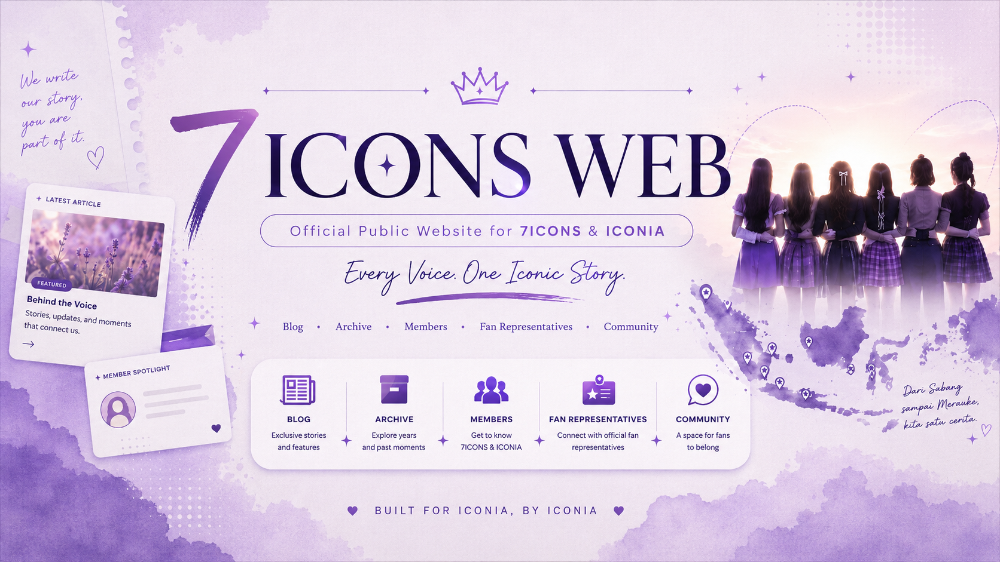

<p align="center">
  
</p>

<h1 align="center">7ICONS Web</h1>

<p align="center">
  <strong>Official Public Website for 7ICONS &amp; ICONIA</strong>
</p>

<p align="center">
  <em>Every Voice. One Iconic Story.</em>
</p>

---

## 💜 About

**7ICONS Web** is the public-facing website of the 7ICONS digital platform — a place for stories, articles, member information, fan representatives, archives, and the ICONIA community.

The website is designed as a combination of a **blog, digital archive, and community platform** dedicated to **7ICONS & ICONIA**.

Visitors will be able to explore articles, discover member profiles, find fan representatives across Indonesia, access archived content, and interact with the community.

---

## ✨ Planned Features

### 🏠 Home

* Featured content
* Latest articles
* News and updates
* Member highlights
* Fan representative highlights
* Community information

### 📰 Blog & Articles

* Article listing
* Featured articles
* Categories
* Search
* Individual article pages
* Related articles

### 👩 Members

* Member profiles
* Member information
* Stories and related content

### 🇮🇩 Fan Representatives

* Fan representatives across Indonesia
* Regional information
* Representative profiles
* Community connections

### 👤 User Accounts

* Registration
* Login
* User profiles
* Custom profile pictures
* Account settings
* Comment history

### 💬 Community

* Article comments
* Community interaction
* User activity
* Moderated discussions

### 🗂️ Archive

* Historical content
* Stories
* Articles
* Community memories
* Past moments surrounding 7ICONS & ICONIA

---

## 🛠️ Tech Stack

The project currently uses:

* **Next.js**
* **React**
* **TypeScript**
* **Tailwind CSS**
* **App Router**
* **React Compiler**

Additional technologies will be introduced as the project develops.

---

## 📁 Project Structure

```text
7icons-web/
├── assets/
│   └── 7icons-web-banner.png
│
├── public/
│
├── src/
│   └── app/
│       ├── favicon.ico
│       ├── globals.css
│       ├── layout.tsx
│       └── page.tsx
│
├── .gitignore
├── AGENTS.md
├── CLAUDE.md
├── eslint.config.mjs
├── next.config.ts
├── package.json
├── package-lock.json
├── postcss.config.mjs
├── README.md
└── tsconfig.json
```

The project structure will continue to evolve as new pages, components, services, and features are introduced.

---

## 🚀 Getting Started

### Requirements

Make sure **Node.js** and **npm** are installed on your system.

Install the project dependencies:

```bash
npm install
```

Start the development server:

```bash
npm run dev
```

Then open:

```text
http://localhost:3000
```

---

## 📜 Available Scripts

### Development

```bash
npm run dev
```

Starts the local development server.

### Production Build

```bash
npm run build
```

Creates an optimized production build.

### Production Server

```bash
npm run start
```

Starts the production server after a successful build.

### Lint

```bash
npm run lint
```

Runs ESLint to check the project source code.

---

## 🚧 Project Status

**Currently in active development.**

Development is being completed gradually, with each section reviewed and finalized before moving on to the next major part of the website.

### Current Progress

* [x] GitHub repository setup
* [x] Next.js initialization
* [x] TypeScript setup
* [x] Tailwind CSS setup
* [x] React Compiler setup
* [x] App Router setup
* [x] Initial Next.js template cleanup
* [x] Project metadata
* [x] Repository README
* [ ] Homepage
* [ ] Blog
* [ ] Article pages
* [ ] Members
* [ ] Fan Representatives
* [ ] Archive
* [ ] User authentication
* [ ] User profiles
* [ ] Profile picture management
* [ ] Comments
* [ ] Backend integration
* [ ] Deployment

---

## 🌐 7ICONS Digital Ecosystem

`7icons-web` is the public-facing application within the broader **7ICONS digital ecosystem**.

The public website is responsible for the experience available to visitors and registered community members.

Administration, content management, user management, comment moderation, and other internal tools will be handled separately through the administration platform.

---

## 💜 Built for ICONIA

This project is more than a website.

It is a digital space where **ICONIA can discover, share, remember, and connect** through stories surrounding 7ICONS.

From **Sabang to Merauke**, every voice and every community has a story worth remembering.

---

<div align="center">

### Every Voice. One Iconic Story.

**BUILT FOR ICONIA, BY ICONIA.**

</div>
